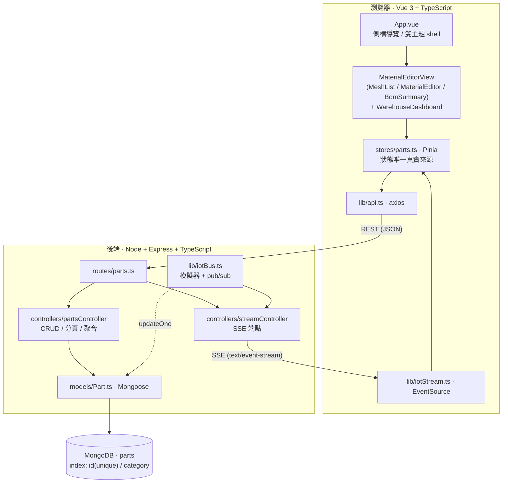
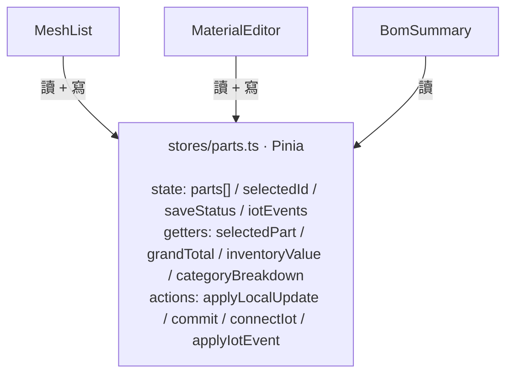
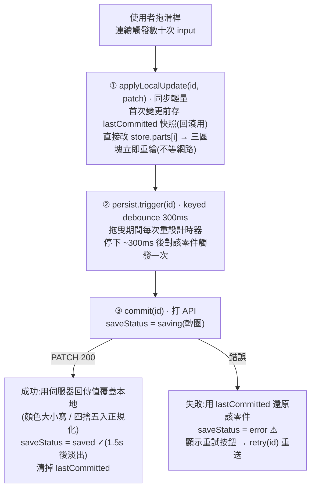
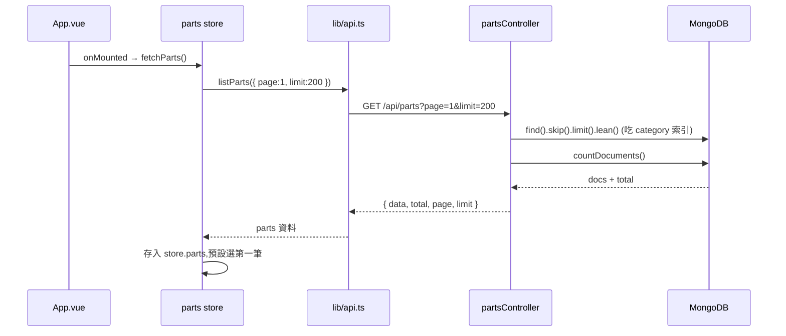
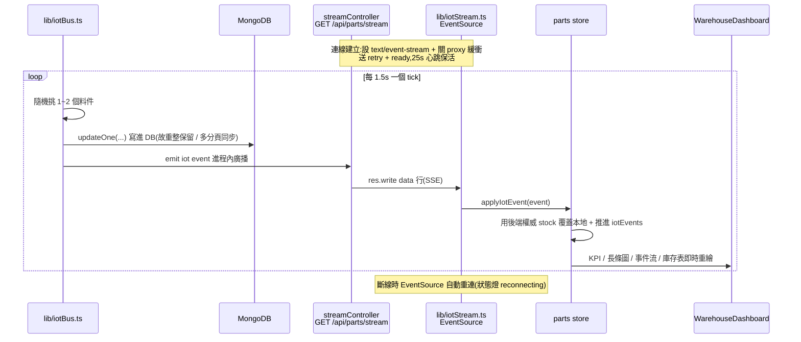
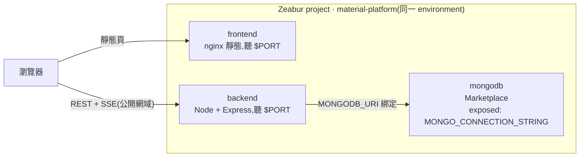

# 技術架構 · 物料管理平台

這份文件講**資料怎麼流動、系統怎麼分層、一次操作的完整生命週期**。
功能操作見 [`GUIDE.md`](./GUIDE.md);設計決策的取捨見 [`README.md`](./README.md) 與 [`ANSWERS.md`](./ANSWERS.md)。

---

## 1. 系統分層

**前後端共用一份計價邏輯**:`lib/pricing.ts` 在前後端各有一份鏡像(`lineTotal = basePrice × multiplier`),確保清單 / 編輯器 / BOM / 後端聚合的數字永遠一致。`lineTotal` 為計算值,**不入庫**。

---

## 2. 前端狀態:單一真實來源

三個沒有父子關係的元件(`MeshList` / `MaterialEditor` / `BomSummary`)不靠 props/events 溝通,而是**都訂閱同一個 Pinia store**。

任一處改了 `parts`,所有依賴它的 getter / template 因 Vue reactivity **自動重繪** —— 編輯器改 multiplier,清單價格與 BOM 總價免手動同步。詳見 [ANSWERS 第一題](./ANSWERS.md)。

---

## 3. 一次編輯的完整生命週期(寫入路徑)

以「拖動 Multiplier 滑桿」為例,展示**樂觀更新 + keyed debounce + 失敗回滾**如何協作:

**為什麼這樣設計**:把「畫面回饋(同步、即時)」和「持久化(非同步、昂貴)」解耦——拖曳維持 60fps、不送洪水請求;網路延遲不影響手感;失敗也不留假資料。詳見 [ANSWERS 第二題](./ANSWERS.md) 與 [第四題](./ANSWERS.md)。

> 關鍵檔案:`MaterialEditor.vue`(觸發)→ `stores/parts.ts`(`applyLocalUpdate` / `commit`)→ `lib/debounce.ts`(keyed debounce)→ `lib/api.ts`(axios PATCH)。

---

## 4. 讀取路徑(初次載入 / 重新載入)

**總價不靠前端加總**:`GET /api/parts/summary` 用 MongoDB aggregation(`$sum: { $multiply: [basePrice, multiplier] }`)在 **DB 端**算出 grandTotal / inventoryValue / lowStockCount——上萬筆時前端也不需下載全部資料來顯示總和。詳見 [ANSWERS 第五題](./ANSWERS.md)。

---

## 5. 即時數據:SSE 推播路徑

IoT 看板的庫存異動由**後端主動推播**,前端被動訂閱。這是與「前端寫、後端存」相反的方向。

**為什麼是 SSE 而非輪詢 / WebSocket**:單向推播正對應「感測器回報」;Node 原生 `res.write` 免套件;`EventSource` 原生自動重連。詳見 [ANSWERS 第四題 (c)](./ANSWERS.md)。

---

## 6. 資料模型(MongoDB / Mongoose)

`backend/src/models/Part.ts` 的 `Part` schema 同時是問答題「數據建模」的解答:

| 欄位 | 型別 / 驗證 | 備註 |
|---|---|---|
| `id` | String, **required, unique, index** | 業務主鍵(`msh-001`),查單筆 O(log n) |
| `name` | String, required | |
| `category` | String, required, **index** | BOM 常以分類過濾 / 分組,索引避免全表掃描 |
| `color` | String, required, `match #RRGGBB` | uppercase 正規化 |
| `basePrice` | Number, required, `min 0` | |
| `multiplier` | Number, required, `min 1, max 5` | 對應前端 slider 範圍 |
| `stock` / `safetyStock` | Number, required | WMS 庫存與安全水位 |
| `location` | String, required, index | 儲位代碼 |
| `metadata` | 嵌入子文件 `{ material, weight }` | `_id: false`,隨主文件讀寫免 join |

`lineTotal` 不入庫(計算值)。詳見 [ANSWERS 第三題](./ANSWERS.md)。

---

## 7. API 一覽

| Method | Path | 用途 |
|---|---|---|
| GET | `/api/parts?page=&limit=&category=` | 分頁清單 `{ data, total, page, limit }` |
| GET | `/api/parts/summary` | DB 端聚合 `{ grandTotal, count, inventoryValue, totalStock, lowStockCount }` |
| GET | `/api/parts/stream` | **SSE** 庫存異動推播 |
| GET | `/api/parts/:id` | 取單筆 |
| PATCH | `/api/parts/:id` | 部分更新(白名單欄位 + Mongoose validators) |
| GET | `/health` | 健康檢查 |

錯誤統一 `{ "error": { "message": "..." } }`,搭配 400 / 404 / 500。

> 路由順序注意:`/summary` 與 `/stream` 必須排在 `/:id` 之前,否則會被當成 `id="summary"/"stream"` 攔截。

---

## 8. 部署拓樸(Zeabur)

- 前端 `VITE_API_BASE_URL` 在 **build 時**烤進產物(瀏覽器直接打後端公開網域)。
- 後端 `MONGODB_URI` 用 `${MONGO_CONNECTION_STRING}/material_editor?authSource=admin` 綁定 mongodb 服務。
- 三服務同一 environment;CORS 由後端 `FRONTEND_ORIGIN` 收斂到前端網域。

實際部署流程與踩雷解法見 [README 部署段](./README.md)。
