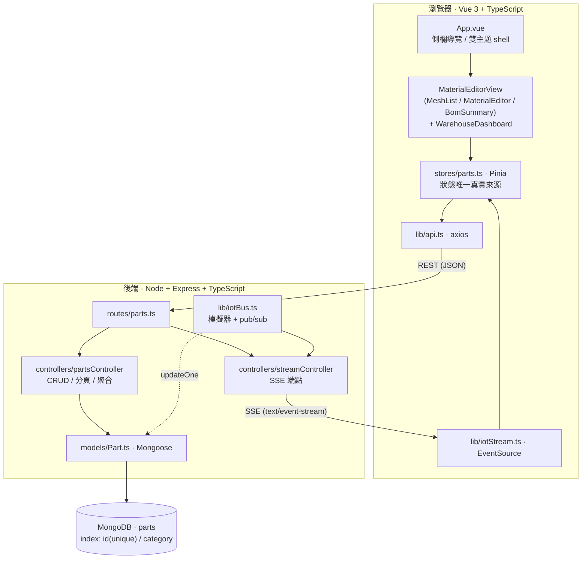
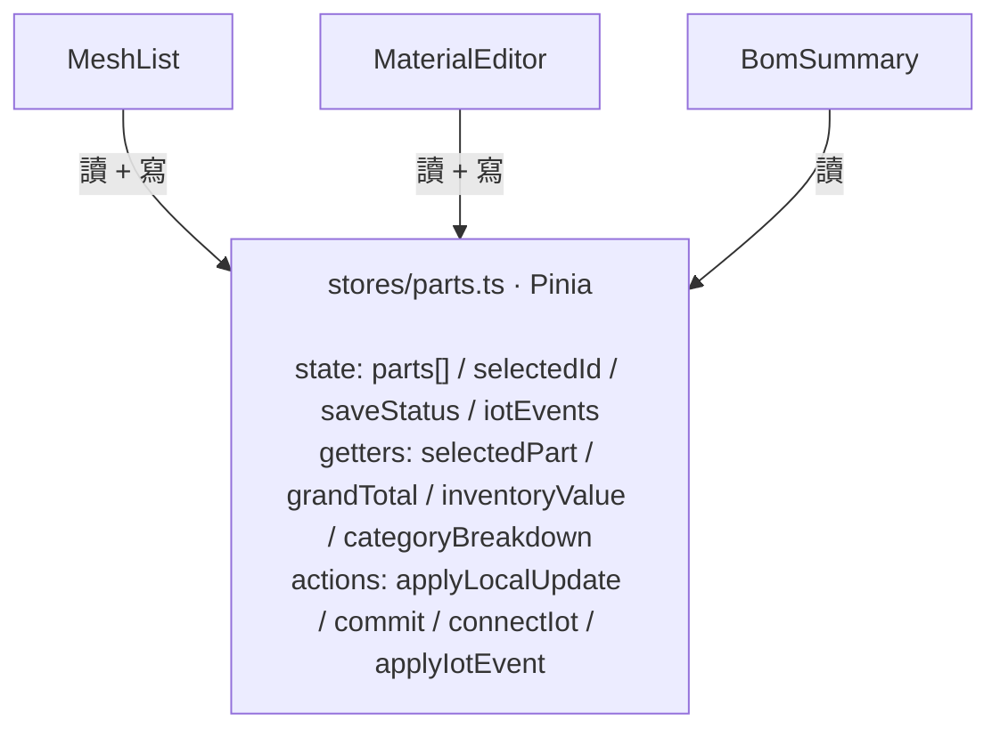
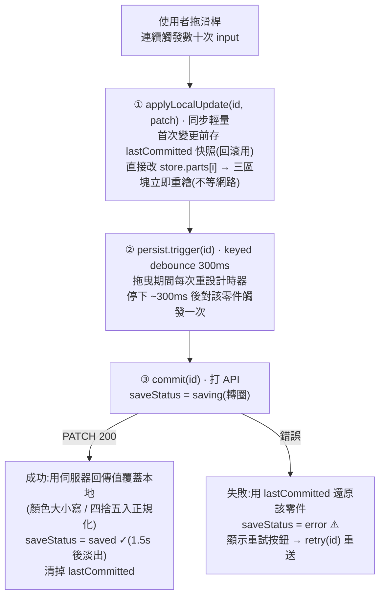
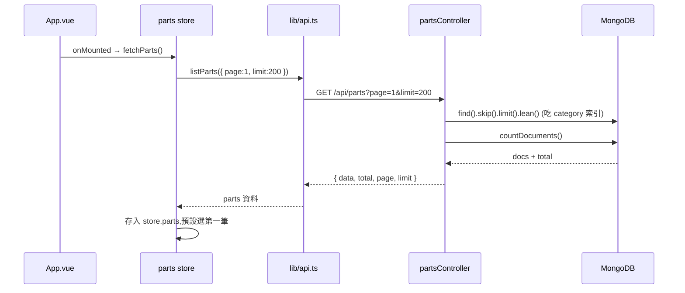
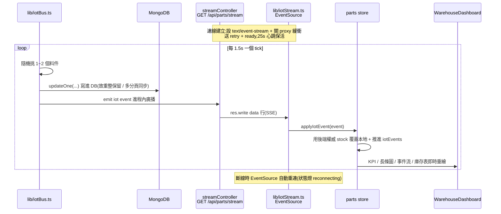
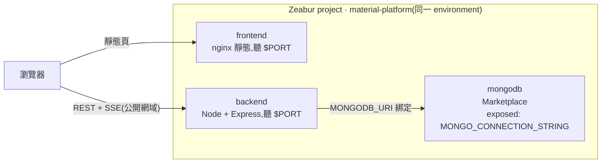

# 技術架構 · 物料管理平台

這份文件講**資料怎麼流動、系統怎麼分層、一次操作的完整生命週期**。
功能操作見 [`GUIDE.md`](./GUIDE.md);設計決策的取捨見 [`README.md`](./README.md) 與 [`ANSWERS.md`](./ANSWERS.md)。

整個系統由三個部署單元組成——**前端(Vue 3 靜態站)**、**後端(Node + Express API)**、**資料庫(MongoDB)**——彼此用標準協定串接:前端對後端走 REST(JSON)做讀寫,後端對前端另開一條 SSE 長連線單向推播即時庫存異動,後端對資料庫則透過 Mongoose ODM 操作。這樣的切分讓三者可以各自獨立部署、獨立擴展,前端甚至能換成任何能打 REST + 接 SSE 的客戶端而後端不必改動。

貫穿全系統的兩條設計主線是:**(1) 前端用單一狀態容器(Pinia store)當唯一真實來源**,讓三個無父子關係的區塊免 prop drilling 即時同步;**(2) 計價邏輯與計算值不落庫**,而是在讀取時即時算,避免多處數字漂移。以下各段會逐一展開。

---

## 1. 系統分層

**前端內部** 由 `App.vue` 作為外殼(側欄導覽、深 / 淺色主題切換),底下掛兩個工作區視圖:`MaterialEditorView`(內含 `MeshList` / `MaterialEditor` / `BomSummary` 三區塊)與 `WarehouseDashboard`。所有視圖都不直接持有資料,而是透過 `stores/parts.ts` 這個 Pinia store 讀寫;對外的兩個出口分別是 `lib/api.ts`(axios 封裝 REST 呼叫)與 `lib/iotStream.ts`(EventSource 封裝 SSE 訂閱)。

**後端內部** 以 `routes/parts.ts` 為入口,分流到兩個 controller:`partsController` 負責 CRUD、分頁與聚合查詢,`streamController` 專責 SSE 端點。資料存取統一收斂到 `models/Part.ts` 定義的 Mongoose model。即時數據的產生者是 `lib/iotBus.ts`——它既把庫存異動寫進 DB(`updateOne`),又透過進程內 pub/sub 把事件廣播給所有 SSE 連線,等於同時扮演「資料寫入者」與「事件發布者」。

**前後端共用一份計價邏輯**:`lib/pricing.ts` 在前後端各有一份鏡像實作,`lineTotal = basePrice × multiplier`、`grandTotal = Σ lineTotal`。為什麼要鏡像而不是只放一邊?因為前端要在拖滑桿時即時算小計(不能每次都問後端),後端 `/summary` 又要在 DB 端算總價(不能把上萬筆丟回前端加總),兩邊都需要這份邏輯——抽成同一份來源,就能確保清單、編輯器、BOM 與後端聚合算出來的數字永遠一致。`lineTotal` 是衍生值,**刻意不入庫**:若存進去,任何一次漏更新都會造成單價與小計對不上,改用即時計算則從根本杜絕這種漂移。

---

## 2. 前端狀態:單一真實來源

這是整個考題的核心。`MeshList`(清單)、`MaterialEditor`(編輯器)、`BomSummary`(BOM)三者在元件樹上是平行的兄弟——它們唯一的共同祖先是 `App`,彼此沒有父子關係。若用傳統的 props 往下傳、events 往上拋,第三個兄弟要拿到另一個兄弟改動的資料,得透過共同祖先層層轉手,形成 prop drilling 加上臃腫的父層協調邏輯,料件欄位一多就難以維護。

我的做法是把共享狀態**提升到元件之外的一個獨立容器**(`stores/parts.ts`),三個區塊都只跟這個容器互動,彼此互不知道對方存在:

store 內部分三類成員,各司其職:**state** 是原始資料(`parts` 陣列、目前選取的 `selectedId`、每筆的儲存狀態 `saveStatus`、IoT 事件流 `iotEvents`);**getters** 是衍生計算(`selectedPart` 取目前選取零件、`grandTotal` 算總價、`inventoryValue` 算庫存總值、`categoryBreakdown` 做分類彙總),它們會被快取、只在依賴的 state 變動時重算;**actions** 是改變狀態的入口(`applyLocalUpdate` 本地套用變更、`commit` 持久化、`connectIot` / `applyIotEvent` 處理即時推播)。

三個區塊的分工是:`MeshList` 讀 `parts` 渲染清單、呼叫 `selectPart` 改選取;`MaterialEditor` 讀 `selectedPart`、呼叫 `applyLocalUpdate` 寫變更;`BomSummary` 純讀 `parts` 與 `grandTotal`。

關鍵在於**自動同步**:Pinia 建立在 Vue 的 reactivity 之上,任一處改了 `parts`,所有依賴它的 getter 與 template 會自動重新計算、重新渲染——不需要任何手動的事件廣播或回呼。所以在編輯器把某零件的 multiplier 從 2.0 拖到 3.0 的瞬間,清單那一列的價格、BOM 對應列的小計、以及 BOM 底部的總價,會「免手動」同時更新。這正是「改一處、三處同步」的技術本質。詳見 [ANSWERS 第一題](./ANSWERS.md)。

---

## 3. 一次編輯的完整生命週期(寫入路徑)

以「拖動 Multiplier 滑桿」為例,展示**樂觀更新 + keyed debounce + 失敗回滾**如何協作:

逐步拆解這條路徑:

1. **本地即時套用(`applyLocalUpdate`)** —— 拖曳時每個 `input` 事件都會呼叫它,但它只做一件輕量的事:直接改 `store.parts[i]` 的值。這是同步操作,沒有任何網路等待,所以三個區塊在同一個事件迴圈內就重繪完成,拖曳手感維持 60fps。此外,它會在「首次變更」前先把該零件的原始值存進 `lastCommitted` 快照,作為稍後失敗回滾的依據。

2. **持久化延後合併(keyed debounce)** —— 真正打 API 的動作不會每次 `input` 都做,而是交給 `lib/debounce.ts` 的 keyed debouncer(預設 300ms)。它以零件 `id` 為 key:拖曳期間每次觸發都重設該 key 的計時器,只有當使用者「停下來」約 300ms 後,才對「那一個零件」送出**一次** PATCH。用 key 區分的好處是——同時編輯不同零件時,各自的持久化互不干擾。

3. **提交與收尾(`commit`)** —— 送出前把 `saveStatus` 設為 `saving`(UI 顯示轉圈)。成功時,用伺服器回傳的權威值覆蓋本地(例如後端把顏色正規化成大寫、把價格四捨五入),`saveStatus` 轉 `saved`(顯示 ✓,1.5 秒後淡出),並清掉 `lastCommitted` 快照。失敗時,用快照把該零件還原成修改前的值,`saveStatus` 轉 `error`,顯示重試按鈕,使用者可呼叫 `retry(id)` 重送。

**為什麼這樣設計**:核心是把「畫面回饋(同步、即時、廉價)」和「持久化(非同步、有延遲、昂貴)」徹底解耦。拖曳只碰前者所以永遠流暢;debounce 讓拖曳過程中數十次的 `input` 收斂成一次請求,既不洪水轟炸後端也不卡前端;樂觀更新讓網路延遲對操作手感零影響;而失敗回滾 + 以伺服器值為準,則保證即使寫入失敗,畫面上也不會殘留一個資料庫裡並不存在的假值。詳見 [ANSWERS 第二題](./ANSWERS.md) 與 [第四題](./ANSWERS.md)。

> 關鍵檔案:`MaterialEditor.vue`(觸發)→ `stores/parts.ts`(`applyLocalUpdate` / `commit`)→ `lib/debounce.ts`(keyed debounce)→ `lib/api.ts`(axios PATCH)。

---

## 4. 讀取路徑(初次載入 / 重新載入)

應用啟動或使用者按「重新載入」時,前端向後端要一批料件資料填進 store。這條路徑刻意做到「前端不必為了顯示而下載全部資料」:

後端的 `listParts` 用 `skip` / `limit` 做伺服器端分頁,每次只回一頁(預設較大的 limit 以容納首屏),並用 `.lean()` 跳過 Mongoose 的文件包裝、只回純物件以減少開銷;`category` 過濾會吃到索引,避免全表掃描。回應同時帶 `total` 總數,讓前端知道還有多少頁。store 拿到資料後填進 `parts`,並預設選取第一筆讓編輯器有初始內容。

**總價不靠前端加總**:這是應對「上萬筆」規模的關鍵設計。如果前端要顯示「專案總估價」「庫存總價值」而去把所有零件撈回來加總,資料一多就會同時壓垮網路傳輸與前端記憶體。改用 `GET /api/parts/summary`,以 MongoDB aggregation 的 `$sum: { $multiply: [basePrice, multiplier] }` 直接在 **DB 端**算出 `grandTotal` / `inventoryValue` / `totalStock` / `lowStockCount`,前端只收到幾個數字。如此一來,無論資料庫有 4 筆還是 4 萬筆,顯示總和的成本恆定。深分頁(skip 數十萬筆)會變慢時,可再進化成以 `id > lastId` 配合索引的 cursor 分頁,效能不隨頁數退化。詳見 [ANSWERS 第五題](./ANSWERS.md)。

---

## 5. 即時數據:SSE 推播路徑

前面幾段都是「前端發起、後端回應」的請求 / 回應模式。IoT 看板則展示相反的方向:**後端主動把庫存異動推給前端**,前端只是被動訂閱、被動更新。這對應考題的「即時數據應用」——模擬倉儲現場的感測器持續回報庫存變化,看板即時刷新。

重點是這份即時數據是**真有後端來源**,不是前端自己跑計時器假裝的:庫存變化在後端產生、寫進資料庫,再推播出去。因此重新整理頁面後庫存會保留(因為已落庫),多個分頁也會同時收到同一份推播而保持一致。

這條鏈路有幾個值得注意的工程細節:後端用進程內的 `EventEmitter` 當 pub/sub——模擬器是唯一的 publisher,每條 SSE 連線各自註冊成一個 subscriber,彼此解耦;SSE 端點在建立連線時會送出 `retry`(告訴瀏覽器斷線後多久重連)與初始 `ready` 事件,並關閉反向代理的緩衝(`X-Accel-Buffering: no`)以確保事件逐筆即時送達而非整批;每 25 秒送一個心跳註解避免中介層因閒置而切斷長連線;最重要的是 `req.on('close')` 會在連線關閉時取消該 subscriber 的訂閱,否則每開一個分頁就累積一個永不釋放的 listener,造成記憶體洩漏。前端則用瀏覽器原生的 `EventSource`,它內建斷線自動重連,所以前端完全不需要自己寫重連邏輯,只需在連線狀態變化時把狀態燈切到 `live` / `reconnecting` / `off`。

**為什麼是 SSE 而非輪詢或 WebSocket**:輪詢實作雖簡單,但有固定延遲、且閒置時也持續打 API,不是真即時;WebSocket 功能最全但是雙向協定,這裡只需要後端單向推播,用它得額外引入套件、還要自己處理重連,屬於過度設計。SSE 恰好落在中間——單向推播正對應「感測器回報」的語意,Node 用原生 `res.write` 就能實作免套件,瀏覽器端 `EventSource` 又自帶重連,是這個情境下最貼切的選擇。詳見 [ANSWERS 第四題 (c)](./ANSWERS.md)。

---

## 6. 資料模型(MongoDB / Mongoose)

`backend/src/models/Part.ts` 的 `Part` schema 同時是問答題「數據建模」的解答。設計時把三件事放在第一位:**型別明確、語意驗證、查詢有索引**。

| 欄位 | 型別 / 驗證 | 備註 |
|---|---|---|
| `id` | String, **required, unique, index** | 業務主鍵(`msh-001`),查單筆 O(log n) |
| `name` | String, required | |
| `category` | String, required, **index** | BOM 常以分類過濾 / 分組,索引避免全表掃描 |
| `color` | String, required, `match #RRGGBB` | uppercase 正規化 |
| `basePrice` | Number, required, `min 0` | |
| `multiplier` | Number, required, `min 1, max 5` | 對應前端 slider 範圍 |
| `stock` / `safetyStock` | Number, required | WMS 庫存與安全水位 |
| `location` | String, required, index | 儲位代碼 |
| `metadata` | 嵌入子文件 `{ material, weight }` | `_id: false`,隨主文件讀寫免 join |

幾個設計重點:**驗證在 schema 層做足**——`color` 用正規表示式限制成 `#RRGGBB` 格式並自動轉大寫,`basePrice` 不可為負,`multiplier` 限定在 1.0~5.0(正好對應前端 slider 的範圍),這些 validator 在每次 `PATCH` 寫入時都會跑,從資料庫這一關就擋掉髒資料,前端的限制只是第一道防線。**索引依查詢型態設**:`id` 是業務主鍵(像 `msh-001`),設 unique index 既能 O(log n) 查單筆、又能防止重複;`category` 設一般 index,因為 BOM 與看板常以分類過濾 / 分組,沒索引時上萬筆會做整表掃描、延遲明顯。**`metadata` 用嵌入子文件**(`material` / `weight`)而非另開 collection,因為它總是隨零件一起讀寫、不需要獨立查詢,內嵌可省去 join。**`lineTotal` 不入庫**——它是 `basePrice × multiplier` 的衍生值,以計算取代儲存,呼應前面提過的「避免數字漂移」原則。詳見 [ANSWERS 第三題](./ANSWERS.md)。

---

## 7. API 一覽

| Method | Path | 用途 |
|---|---|---|
| GET | `/api/parts?page=&limit=&category=` | 分頁清單 `{ data, total, page, limit }` |
| GET | `/api/parts/summary` | DB 端聚合 `{ grandTotal, count, inventoryValue, totalStock, lowStockCount }` |
| GET | `/api/parts/stream` | **SSE** 庫存異動推播 |
| GET | `/api/parts/:id` | 取單筆 |
| PATCH | `/api/parts/:id` | 部分更新(白名單欄位 + Mongoose validators) |
| GET | `/health` | 健康檢查 |

錯誤統一 `{ "error": { "message": "..." } }`,搭配 400 / 404 / 500。

> 路由順序注意:`/summary` 與 `/stream` 必須排在 `/:id` 之前,否則會被當成 `id="summary"/"stream"` 攔截。

---

## 8. 部署拓樸(Zeabur)

三個服務(frontend / backend / mongodb)部署在 Zeabur 的同一個 project、同一個 environment 下,彼此可用 Zeabur 的變數綁定機制互相引用設定,不必把連線字串寫死在程式碼裡:

- **前端的 `VITE_API_BASE_URL` 在 build 時就烤進產物**。因為 Vite 的環境變數是編譯期注入、之後就成了 bundle 裡的字面值,而真正去打後端的是「瀏覽器」(不是前端容器),所以這個值必須是後端的公開網域、且必須在 build 之前就設定好——這是部署這類 SPA 最容易踩的順序陷阱。
- **後端的 `MONGODB_URI` 用變數綁定組成**:`${MONGO_CONNECTION_STRING}/material_editor?authSource=admin`,引用 mongodb 服務 exposed 的連線字串,再補上資料庫名與 `authSource=admin`(Marketplace MongoDB 的 root 帳號建在 `admin` 庫,不補會認證失敗)。
- **三服務同處一個 environment**,後端透過內部網路連 MongoDB(低延遲、不佔公開頻寬);對外則由後端的 `FRONTEND_ORIGIN` 把 CORS 收斂到前端網域,讓 `EventSource` 的跨來源 SSE 連線得以放行、同時擋掉其他來源。

完整的 CLI 部署步驟、以及過程中踩到的 5 個雷(region 代碼改制、跨服務變數綁定語法、authSource、nginx 須聽 `$PORT`、`VITE` build-arg)及其解法,見 [README 部署段](./README.md)。
