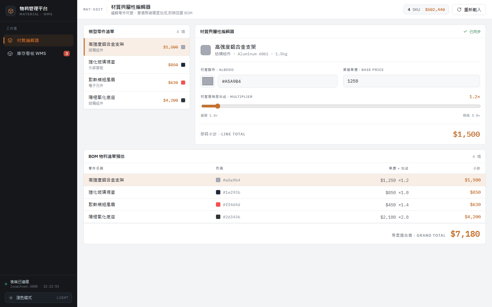
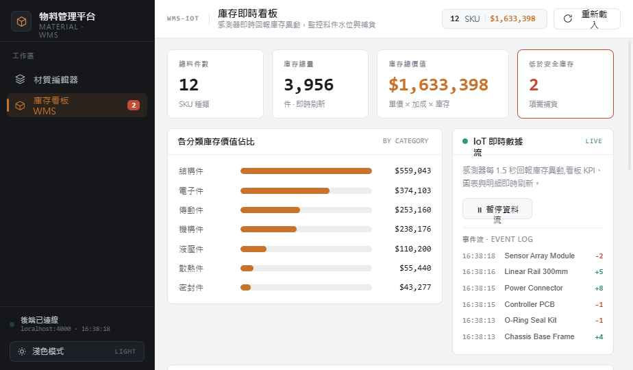

# 智慧製造 · 物料管理平台

一個全端的物料管理平台,前端以頁籤切換兩個檢視,共用同一份後端與狀態層:

- **材質編輯器**:左側「模型零件清單」、右側「材質與屬性編輯器」、下方「BOM 物料總表」三區塊共享同一份零件狀態,在編輯器修改顏色 / 單價 / 加成時,清單與 BOM 即時同步更新。
- **WMS / IoT 看板**:以倉儲視角呈現同一份料件資料——KPI 卡片(總料件數 / 庫存總量 / 庫存總價值 / 低於安全庫存數)、各分類庫存價值長條圖、含安全庫存水位與低庫存警示的庫存明細表,以及 IoT 感測器即時回報庫存異動、看板即時刷新。

## 🔗 線上 Demo

| | 網址 |
|---|---|
| **前端(可直接操作)** | https://material-editor-d1.zeabur.app |
| 後端 API | https://material-api-d1.zeabur.app |

> 進入後可點選左側零件、拖動 Multiplier 滑桿(清單與 BOM 即時同步),或切到「庫存看板 WMS」看後端 SSE 推播的即時庫存異動。右下角可切換深 / 淺色主題。

### 材質編輯器

清單 / 編輯器 / BOM 三區塊共享同一份 Pinia store,改一處三處即時同步:



### WMS / IoT 看板

KPI、分類庫存長條圖,與後端 SSE 推播的 IoT 事件流:



| 層 | 技術 |
|---|---|
| 前端 | Vue 3 + TypeScript + Vite + Pinia + Axios |
| 後端 | Node.js + Express + TypeScript + Mongoose |
| 資料庫 | MongoDB |
| 部署 | Zeabur(前端、後端、MongoDB 各一個服務) |

> 實作需求與問答題見 [`proposal.md`](./proposal.md);問答題解答見 [`ANSWERS.md`](./ANSWERS.md)。

---

## 專案結構

```
.
├── backend/            Node + Express + Mongoose API
│   └── src/
│       ├── models/Part.ts          Mongoose schema(= 問答題第 3 題解答)
│       ├── controllers/            partsController(CRUD/分頁/聚合)+ streamController(SSE)
│       ├── routes/                 路由
│       ├── lib/pricing.ts          價格計算(與前端同一份邏輯)
│       ├── lib/iotBus.ts           IoT 模擬器 + SSE pub/sub(寫入 DB 並廣播)
│       ├── scripts/seed.ts         匯入種子資料(支援 --bulk=N)
│       ├── data/seed-parts.json    proposal 的 4 筆標準零件
│       ├── app.ts / server.ts      app 與啟動分離
│       └── db.ts                   MongoDB 連線
├── frontend/           Vue 3 + Pinia 前端
│   └── src/
│       ├── stores/parts.ts         單一狀態來源 + 樂觀更新 + debounce + SSE 套用
│       ├── components/             MeshList / MaterialEditor / BomSummary / SaveIndicator
│       ├── views/                  MaterialEditorView / WarehouseDashboard
│       ├── lib/                    api(axios)/ pricing / debounce / iotStream(EventSource)
│       └── App.vue                 側欄導覽 + 雙主題 shell
├── docs/screenshots/   README 用截圖
├── ANSWERS.md          問答題解答
└── proposal.md         原始考題
```

---

## 本機開發

需求:Node.js ≥ 20、一個可連線的 MongoDB。

最快取得 MongoDB(Docker):

```bash
docker run -d --name me-mongo -p 27017:27017 mongo:7
```

### 1) 後端

```bash
cd backend
npm install
cp .env.example .env        # 確認 MONGODB_URI / PORT / FRONTEND_ORIGIN
npm run seed                # 匯入 4 筆標準零件(可選 --bulk=10000 灌大量資料)
npm run dev                 # http://localhost:4000
```

### 2) 前端

```bash
cd frontend
npm install
cp .env.example .env        # VITE_API_BASE_URL=http://localhost:4000
npm run dev                 # http://localhost:5173
```

開啟 http://localhost:5173,點選左側零件、拖動 Multiplier 滑桿,左側價格與下方 BOM 會即時同步。

---

## API

| Method | Path | 說明 |
|---|---|---|
| GET | `/api/parts?page=&limit=&category=` | 分頁清單,回 `{ data, total, page, limit }` |
| GET | `/api/parts/summary` | DB 端聚合,回 `{ grandTotal, count, inventoryValue, totalStock, lowStockCount }`(應對上萬筆) |
| GET | `/api/parts/stream` | **SSE**:後端 IoT 模擬器把庫存異動寫入 DB 並即時推播(`text/event-stream`) |
| GET | `/api/parts/:id` | 取單筆 |
| PATCH | `/api/parts/:id` | 部分更新(color / basePrice / multiplier / name / category) |
| GET | `/health` | 健康檢查 |

錯誤格式統一為 `{ "error": { "message": "..." } }`,搭配 400 / 404 / 500。

`lineTotal = basePrice × multiplier`,`grandTotal = Σ lineTotal`,皆為**計算值不入庫**,前後端共用同一份邏輯(`lib/pricing.ts`)避免不同步。

### IoT 即時數據流(SSE)

「即時數據應用」由**後端**作為真實來源,而非前端假動作:

- 後端 `lib/iotBus.ts` 的模擬器每 1.5 秒隨機挑料件、把庫存異動 **寫入 MongoDB**(`updateOne`),再透過進程內 pub/sub 廣播。
- `GET /api/parts/stream`(`controllers/streamController.ts`)是 SSE 端點:每個瀏覽器連線訂閱事件、以 `data: <json>\n\n` 推播,並有 25s 心跳保活、連線關閉時取消訂閱。
- 前端 `lib/iotStream.ts` 用原生 `EventSource` 訂閱(SSE 原生**自動重連**);store 用後端權威 `stock` 覆蓋本地值。
- 因為來源在後端 / DB:**重整後庫存保留**、**多個分頁同步**。看板狀態燈三態:`LIVE` / `RECONNECT…` / `PAUSED`。

---

## 部署到 Zeabur

一個 project 下三個服務(**backend / frontend / mongodb**)共用同一個 environment。以下是用 Zeabur CLI 實際跑通的流程(已驗證),非僅理論。

### 流程

```bash
# 0) 登入(本機開瀏覽器)
npx zeabur@latest auth login

# 1) 建 project。注意:region 代碼已改制,須用 server-<id>(從你的 server 清單取)
npx zeabur@latest server list --json                       # 取得 dedicated server 的 ID
npx zeabur@latest project create --name material-platform --region server-<SERVER_ID> --json

# 2) 部署後端(在 backend/ 目錄,Root Directory = backend)
cd backend
npx zeabur@latest deploy --project-id <PROJECT_ID> --create --name backend -i=false --json

# 3) 加 MongoDB(官方 Marketplace 模板,code=KXL04P)
npx zeabur@latest template deploy -c KXL04P --project-id <PROJECT_ID> -i=false --json

# 4) 設後端環境變數(用 .env 檔餵入最穩,避免 shell 展開 ${...})
#    MONGODB_URI 引用 mongodb 服務 exposed 的連線字串,並補 db 名與 authSource:
cat > .env <<'EOF'
MONGODB_URI=${MONGO_CONNECTION_STRING}/material_editor?authSource=admin
FRONTEND_ORIGIN=*
EOF
npx zeabur@latest variable env --id <BACKEND_SVC_ID> --env-id <ENV_ID> -f .env

# 5) 重新部署後端套用變數,開公開網域
npx zeabur@latest deploy --service-id <BACKEND_SVC_ID> --environment-id <ENV_ID> -i=false --json
npx zeabur@latest domain create --id <BACKEND_SVC_ID> --env-id <ENV_ID> \
  --generated=true --domain material-api -y -i=false --json

# 6) 在後端容器內 seed 一次(prod 鏡像已含 dist/scripts/seed.js)
npx zeabur@latest service exec --id <BACKEND_SVC_ID> --env-id <ENV_ID> -- node dist/scripts/seed.js

# 7) 部署前端(Root Directory = frontend),開網域
cd ../frontend
npx zeabur@latest deploy --project-id <PROJECT_ID> --create --name frontend -i=false --json
npx zeabur@latest domain create --id <FRONTEND_SVC_ID> --env-id <ENV_ID> \
  --generated=true --domain material-editor -y -i=false --json

# 8) 收斂 CORS:把後端 FRONTEND_ORIGIN 改成前端網址,再重部署後端
```

驗證:`curl https://<後端>/health`、`curl -N https://<後端>/api/parts/stream`(SSE 應逐行即時冒出)。

### ⚠️ 過程踩到的 5 個雷(本 repo 已內建解法)

1. **region 代碼改制** — 舊代碼(`tyo`/`hnd1`/`tpe1`)已失效,`project create --region` 須用 `server-<server-id>`(`server list` 取得)。
2. **跨服務變數綁定語法** — 引用其他服務的變數是 `${VAR}`(非 `${service.VAR}`)。寫錯會讓 `MONGODB_URI` 沒展開,後端報 `Invalid scheme`。
3. **MongoDB 認證** — Marketplace MongoDB 的 root 帳號建在 `admin` db,連線字串須補 `?authSource=admin`,否則 `Authentication failed`。
4. **前端 nginx 502** — Zeabur 要容器監聽注入的 `$PORT`。`frontend/Dockerfile` 已改成 `ENV PORT=8080` + envsubst 模板讓 nginx 聽 `$PORT`(寫死 80 會 502)。
5. **`VITE_API_BASE_URL` 沒烤進產物** — Zeabur 不保證把 dashboard 變數當 `--build-arg` 傳給 docker build,易把 `localhost:4000` 烤進 bundle。`frontend/Dockerfile` 的 `ARG VITE_API_BASE_URL` 預設值直接設成線上後端網址(此為公開值,寫死無安全疑慮;其他環境用 `--build-arg` 覆寫)。

> 憑證一律走環境變數綁定,不寫死於程式碼。`.env` 僅用於 CLI 餵變數,**不入庫**(已在 `.gitignore`)。

### SSE 部署注意

`/api/parts/stream` 是長連線 SSE。端點已送 `Cache-Control: no-transform` 與 `X-Accel-Buffering: no` 關閉反向代理緩衝;Zeabur 代理實測可直接運作(事件逐筆即時送達)。若上線後看板事件「不即時、整批才到」,多半是中介層在 buffer 或連線被提早關閉——確認代理未對該路徑緩衝即可。CORS 白名單(`FRONTEND_ORIGIN`)需含前端公開網址,`EventSource` 才連得上跨來源端點。
